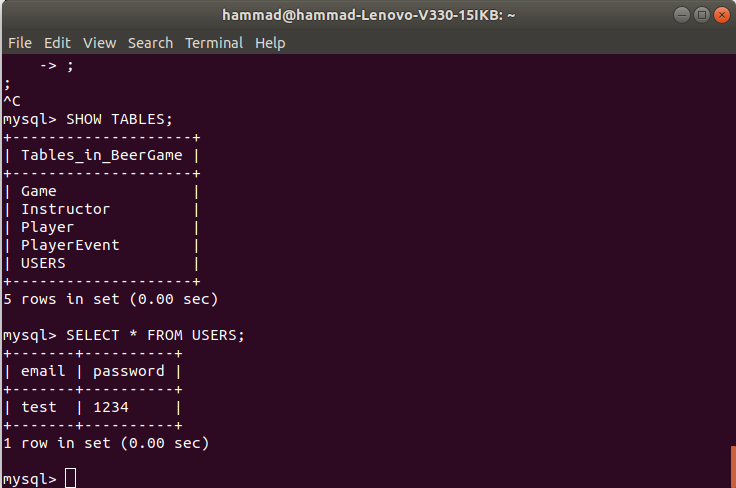

#   Beer Game 🍻

[](https://GitHub.com/Naereen/StrapDown.js/releases/)


## Table of Contents

* [About the Project](#about-the-project)
    * [Built with](#built-with)
* [Screenshots](#screenshots)
* [Getting Started](#getting-started)
    * [Prerequisites](#prerequisites)
    * [Run the app](#run-the-app)
* [Current UI Guide](#current-ui-guide)
* [Testing](#testing)
* [Documentation](#documentation)
* [Code](#code)
* [Database](#database)
* [Contributors](#contributors)

## About the Project
The beer game is an online game intended for students to better understand how supply chain works in a real world situation, applying the theory learned in class and practicing decision making. Therefore it is a functional type of game. This project simulates the way beer is being ordered and delivered from production and factory, going to distributor, then wholesaler and then to retailer and consumer. Each of these stages can be played by the students who, order enough beer stock in the position they hold, taking into consideration shipment times, delays, backorders, inventory such that, every partner in this chain doesn’t suffer any losses.

### Built with
* [C++](http://www.cplusplus.com)
* [Qt Creator](https://www.qt.io/download)
* [CMake](https://cmake.org/cmake-tutorial)
* [Doxygen](http://www.doxygen.nl/manual/starting.html)
* [Google Test](https://github.com/janoszen/clion-project-stub/blob/master/gtests/googletest/docs/Primer.md)

## Getting Started

These instructions will get you a copy of the project up and running on your local machine for development and testing purposes.

## Prerequisites
* Qt5 SDK
```sh
brew install qt5
```
* GTest

Installion on Linux
```sh
sudo apt-get install libgtest-dev
```

Installation on Mac
```sh
brew install libgtest-dev
```

### Run the app

You have to set your Qt location in CMakeLists if it doesn't work via set(CMAKE_PREFIX_PATH PATH_TO_QT)

```
cd build
cmake .. -DCMAKE_PREFIX_PATH=$(brew --prefix qt5)
make
cd src
./beergame
```
## Current UI Guide


You will need to install a few extra libraries like Qt Charts and Qt WebEngine Widgets. You can install them using the following commands:
```
sudo apt install libqt5charts5 libqt5charts5-dev
```
```
sudo apt-get update && sudo apt-get install qtwebengine5-dev
```

Currently a login ui has been implement where :

For Instructor:
```
User Email : test
Password   : 1234
Instructor : ✅ (True)
```
For Player: 
```
User Email : test
Password   : 1234
Instructor : (Not ticked : False)
```

* Updated Password field so that password is hidden while typing.
* Resolved a few issues/warnings in the gui for instance ununsed variables, singed vs unsigned integers.
* Integrated MySQL (instead of SQlite) in the code as well as the pro file. Added code to link database.
* Removed unncessary buttons from Player & Instructor screens that were no longer required.


## Testing

Follow these commands to run the tests:

```
cd build
cmake .. -DCMAKE_PREFIX_PATH=$(brew --prefix qt5)
make
cd tests
./beergame-tests
```
* Increased the line coverage to **98.5%** (src/backend folder).
* Modified tests for methods like increaseInventory, decreaseInventory, advanceWeek etc to fit the class diagram.
* Added more tests like:

* Player:
    - placeOrderFactoryTest
    - getDownstreamConsumerTest
    - decreaseInventoryTest
    - increaseInventoryTest
    - receiveShipmentInventoryTest
* Instructor:
    - setGamesTest
    - getGamesTest
    - showGameStatusTest
* Game:
    - addOrderTest
    - addShipmentTest
    - setBackOrderCostTest
    - setNOrdersReceivedTest
    - getNOrdersReceivedTest
    - setNShipmentsReceivedTest
    - getNShipmentsReceivedTest
    - gameReadyToStartTest
    - getNotReadyToStartTest
    - gameConstructorTest
    - advanceWeekTest
* PlayerEvent:
    - getToPlayerIdTest
* Shipment:
    - shipmentConstructorTest
* Order:
    - orderConstructorTest

Total Tests: 141

## Documentation

Documentation is generated automatically upon 
```
cd build
cmake ..
make
```

* Fixed the CMake so that the ```doc``` is generated inside the ```build``` directory now.
* Added a main page with information about beergame and a logo.
* Modified the cmake in a way that the main page of the documentation can open automatically after ```make``` using Firefox.
* Included the ```tests``` file in the documentation and documented all existing and new tests.
* Fixed other minor issues that were causing warnings for instance, the use of ```\bried``` instead of ```\brief``` and ```\params``` instead of ```\param```. A few parameters were incorrect while some were missing. For example, orderedInWeek was not a parameter of Shipment but was incorrectly written. 

## Code

* Modified methods like increaseInventory, decreaseInventory, advanceWeek etc to fit the class diagram.
* Removed a bunch of warnings for example unused variables, unsigned vs signed int etc.
* Implemented remaining methods like showGameStatus and some setters/getters etc.

## Database

Since I couldn't access the CLAMV due to some port issue, I created a local MySQL database. This could be used for user login authentication by storing usernames/emails and passwords in the ```Users``` table of the database. We also added code in ```main.cpp``` to link the GUI with the database. 



Since the local database couldn't be exported as a ```.db``` file, we're submitting a ```mysqldump``` in the file ```beerGame.sql```. Although the networking doesn't work fully, it could be graded partially.

Note: Even when I was able to establish a connection for CLAMV, I was not able to login. I kept gettign the ```Permission Denied``` error.

## For the Future

We can use some sort of hash functions to store passwords so that direct passwords cannot be accessed from the tables in the database.

## Contributors

**nhammad** : Gui, Database/Backend, Documentation ,Testing

**Flori**:  ...
